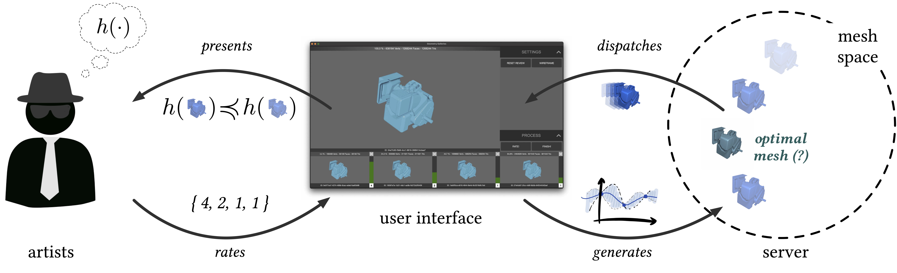

# The Human in the _Infinite Loop_



**The Human in the _Infinite Loop_: <br/>A Case Study on Revealing and Explaining Human-AI Interaction Loop Failures** <br/>
**[Changkun Ou](https://changkun.de)**, **[Daniel Buschek](https://daniel-buschek.de)**, **[Sven Mayer](https://sven-mayer.com)**, and **[Andreas Butz](http://butz.org)** <br/>
In Proceedings of the Mensch und Computer 2022 (MuC’22). ACM, September 4-7, 2022, Darmstadt, Germany.
https://doi.org/10.1145/3543758.3543761

This repository includes instructions to download the collected dataset (anonymized), the technical specifications to access our system tools, as well as scripts to reproduce the results reported in the paper.

## Dataset

The complete raw dataset can be downloaded from [changkun.de/s/infloop/dataset](https://changkun.de/s/infloop/dataset).

There are two different collections:

1. Field collection: All data are collected from two full-time technical artists.
2. Lab collection: All data are collected from 20 consented participants.

All data points from two collections are organized using the same policy and stored in the [`sessions`](./dataset/sessions) folder:

```sh
<session-id>                  # session folder
<session-id>/base.json        # central configuration file that includes all human ratings
<session-id>/<model-id>.fbx   # an intermediate model produced as FBX format in a session
<session-id>/<model-id>.obj   # the same model but merged as a single object and converted to OBJ format
<session-id>/<model-id>.json  # the configuration file of its corresponding model <model-id>.fbx
```

Note that if `<model-id>` is equal to the `<session-id>`, then this model is the initial model for mesh simplification.

To obtain the session IDs for each dataset, check the [metadata](./dataset/metadata/) folder and which contains more classified information regarding different session IDs. In particular:

```sh
metadata
├── time.csv                     # operating system recorded time of creation
├── field                        # include session IDs in the field study
│   ├── broken.txt               # sessions with broken models that cannot be processed
│   ├── single.txt               # sessions without initial simplification
│   ├── unevaluated.txt          # sessions without preference optimization
│   ├── evaluated-complete.txt   # sessions with complete preference optimization (all variants have ratings)
│   └── evaluated-incomplete.txt # sessions with incomplete preference optimization (some models do not have ratings)
└── lab                          # include session IDs in the lab study
    ├── seq.json                 # recorded interaction sequence
    ├── q1.csv                   # subjective questionaire from the first group of participants
    ├── q2.csv                   # subjective questionaire from the second group of participants
    └── all.txt                  # sessions collected from lab study, derived from seq.json
```

Session IDs in the dataset may be excluded from these files because they are produced outside the formal study periods.

## Tools

The polygon reduction system tool and relevant development SDK can be found in the [tools](./tools) folder.

## Scripts and Figures

To reproduce the results and figures that appeared in the paper, one can find all scripts in the [scripts](./scripts) folder and all figures in the [assets](./assets) folder.

Furthermore, a collection of scripts are developed for preprocessing located in the [utils](./utils) folder.

## Contribute

The easiest way to contribute is to provide feedback! We would love to hear what you think. Please write to [research@changkun.de](mailto:research[at]changkun.de) for closer communication.

## Licenses and Citation

Copyright &copy; 2022. [LMU Munich Media Informatics Group](https://www.medien.ifi.lmu.de). All rights reserved.

The [dataset](./dataset) itself (i.e., metadata, generated models, generated configurations), available in [Creative Commons Public Domain Dedication (CC-0)](https://creativecommons.org/share-your-work/public-domain/cc0/), represented the results from consented anonymous participants and was collected by [Changkun Ou](https://changkun.de). However, the original 3D meshes are considered copyright artwork courtesy of [WAY Digital Solutions](https://way-ds.de), Jeff H, Jose Olmedo, kenik, yarulesemel, and Stephan Thieme.
The contained "source code" (i.e., Python, Go scripts, and SDKs) of this work is made available under the terms of [GNU GPLv3](./LICENSE) (by default) or [MIT](./tools/polyreduce-sdk-go/LICENSE) (otherwise specified) license.

If you find our research is helpful, we would appreciate a citation via:

```bibtex
@inproceedings{ou2022infloop,
	title        = {The Human in the Infinite Loop: A Case Study on Revealing and Explaining Human-AI Interaction Loop Failures},
	author       = {Changkun Ou and Daniel Buschek and Sven Mayer and Andreas Butz},
	year         = 2022,
	booktitle    = {Proceedings of Mensch Und Computer 2022},
	publisher    = {Association for Computing Machinery},
	address      = {Darmstadt, Germany},
	series       = {MuC\'22},
	doi          = {10.1145/3543758.3543761},
}
```